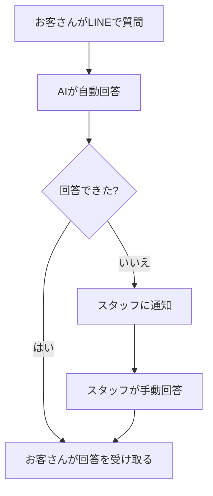

# ユーザー体験設計

## トリガー

「ユーザー体験を決めたい」「使い方の流れを考えたい」「UXを設計したい」「どういう流れにするか」「画面の流れを考えたい」等

## 概要

クライアントとの対話を通じて、「誰が」「どこから」「何をして」「何が起きるか」を整理し、ユーザーの行動フローを `ux-design.md` として生成する。
要件定義の前段階として使うことを想定。技術用語は使わず、利用者目線で進める。

## 手順

### Step 1: 対象の確認

TASKLIST.md が存在する場合、そこに書かれたプロジェクト概要を読み、確認から始める:

「タスクリストによると、[プロジェクト概要] ですね。この中で、ユーザーが実際に操作する部分の流れを一緒に考えていきましょう。」

TASKLIST.md がない場合:
「どんなサービスやツールのユーザー体験を考えたいですか？ざっくりで大丈夫です。」

### Step 2: 登場人物の整理

以下を順番に聞く:

**まず:**
「これを使う人は誰ですか？（例: お客さん、社員、管理者など）複数いれば全部教えてください。」

**回答を受けて:**
「それぞれの人が、このサービスに何を期待していますか？どんな目的で使いますか？」

整理して提示する:

```
■ 登場人物
- お客さん → 質問して回答を得たい
- スタッフ → 回答内容を管理したい
```

「こんな感じですか？追加や修正があれば教えてください。」

### Step 3: 利用シーンの特定

登場人物ごとに聞く:

1. 「[登場人物] は、**どこから**このサービスにアクセスしますか？（例: LINEから、Webブラウザから、アプリから）」
2. 「**いつ**使いますか？（例: 困ったとき、毎日、月に1回）」
3. 「**どんな状況**で使いますか？（例: 外出先でスマホから、オフィスでPCから）」

### Step 4: 行動フローの組み立て

最も重要な登場人物から、行動の流れを一緒に作る:

「[登場人物] がこのサービスを使うとき、最初に何をしますか？そこから順番に、何が起きるかを一緒に追っていきましょう。」

クライアントの回答をもとに、ステップごとに整理する:

```
1. お客さんがLINEでメッセージを送る
2. AIが自動で返答する
3. AIが答えられない場合、スタッフに通知される
4. スタッフが手動で回答する
```

「こういう流れで合っていますか？抜けているステップや、分岐はありますか？」

**分岐がある場合は深掘りする:**
「○○の場合はどうなりますか？」「うまくいかなかった場合はどうしますか？」

### Step 5: フロー図の作成

整理した行動フローを Mermaid のフロー図にする:

「流れを図にしてみました。見やすいか確認してください。」



複数の登場人物がいる場合は、それぞれのフロー図を作成する。

### Step 6: 画面・タッチポイントの整理

「ユーザーが操作する画面やタッチポイント（LINEの画面、Webページなど）をざっくり整理しましょう。」

各画面について:
1. 「この画面で、ユーザーは何をしますか？」
2. 「画面には何が表示されていますか？」
3. 「次にどこに進みますか？」

### Step 7: ux-design.md の生成

ヒアリング内容をもとに `ux-design.md` を生成する。
生成前にチャットで内容をプレビューし、クライアントに確認する。

**ファイル形式:**

```markdown
# UX設計書: [プロジェクト名]

作成日: [YYYY-MM-DD]

## 1. 概要

[このサービス/ツールが何をするものか 1〜2文で]

## 2. 登場人物

| 登場人物 | 目的 | 利用頻度 | デバイス |
|---|---|---|---|
| [誰] | [何のために使うか] | [どのくらい] | [PC/スマホ等] |

## 3. 利用シーン

### [登場人物1]

- **いつ**: [利用タイミング]
- **どこから**: [アクセス手段]
- **状況**: [利用時の状況]

## 4. 行動フロー

### メインフロー: [フロー名]

[Mermaid フロー図]

**ステップ詳細:**

| # | 操作者 | アクション | 結果 |
|---|---|---|---|
| 1 | [誰が] | [何をする] | [何が起きる] |

### 分岐・例外フロー

[分岐がある場合のフロー]

## 5. 画面・タッチポイント一覧

| # | 画面名 | 操作者 | 主な機能 |
|---|---|---|---|
| 1 | [画面名] | [誰が使う] | [何ができる] |

## 6. 次のステップ

[要件定義への接続など]
```

### Step 8: 確認と保存

1. チャットに UX 設計書の内容をプレビュー表示する
2. 「この内容で問題なければ、UX設計書として保存します。修正したい箇所があれば教えてください。」
3. クライアントが OK を出したら、ワークスペースルートに `ux-design.md` を保存する
4. 「UX設計書を作成しました！この内容をもとに、次は要件定義に進みましょう。」

## 注意事項

- 技術用語は使わない。「API」ではなく「裏側の仕組み」、「UI」ではなく「画面」と言う
- フロー図は必ず作る。視覚化するとクライアントが理解しやすい
- 最初から完璧を目指さない。「まずは一番大事な流れだけ作りましょう」と伝える
- 行動フローが複雑になりすぎたら分割を提案する
- 要件定義スキルとの連携を意識する。ここで決めたフローが要件定義の入力になる
